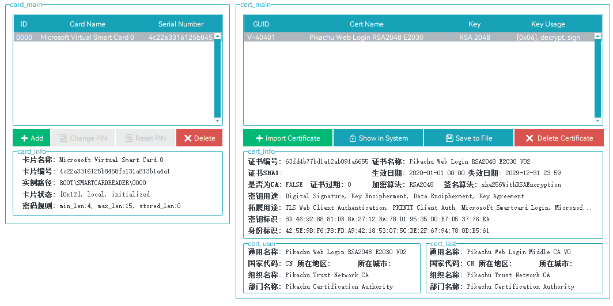

# TPM虚拟智能卡管理器

# TPM Virtual Smart Cards Manager

Create &amp; Manage Smart Cards on TPM

创建和管理TPM虚拟智能卡

## 介绍 / Introduction

本工具用于管理TPM虚拟智能卡，依赖于微软“Tpmvscmgr”模块。可以帮助用户在计算机上安全地存储和管理加密密钥、证书和其他敏感信息。TPM（受信任平台模块）是一个硬件安全模块，通常集成在计算机主板上，提供加密和安全功能。

This tool is used to manage TPM virtual smart cards and relies on the Microsoft "Tpmvscmgr" module. It can help users securely store and manage encryption keys, certificates, and other sensitive information on their computers. TPM (Trusted Platform Module) is a hardware security module typically integrated on a computer motherboard, providing encryption and security functions.

相较于直接存储证书在Windows系统内，使用TPM虚拟智能卡的有点包括：

Compared to directly storing certificates within the Windows system, the advantages of using TPM virtual smart cards include:

- 安全性高：由于智能卡数据存储在硬件中，因此很难被黑客攻击。
- High security: Due to the fact that smart card data is stored in hardware, it is difficult to be attacked by hackers.
- 便于管理：用户可以轻松地在计算机上创建、删除和管理虚拟智能卡。
- Easy to manage: Users can easily create, delete, and manage virtual smart cards on their computers.
- 易于集成：许多操作系统和应用程序已经支持TPM虚拟智能卡，无需额外的硬件。
- Easy to integrate: Many operating systems and applications already support TPM virtual smart cards without the need for additional hardware.
- 成本效益：与传统的物理智能卡相比，TPM虚拟智能卡可以节省硬件和管理成本。

- Cost effectiveness: Compared to traditional physical smart cards, TPM virtual smart cards can save hardware and management costs.

<b color="red">注意：在使用本工具前，您需要提前安装[OpenSC](https://github.com/OpenSC/OpenSC/releases) / Notice: Before using this tool, you need to install [OpenSC](https://github.com/OpenSC/OpenSC/releases) </b>

### 功能 / Function

- 虚拟智能卡管理：创建、删除、虚拟智能卡，修改重置密码
- 证书和密钥管理：导入、删除、证书和密钥，查看数字证书

- Virtual smart card management: create, delete, virtual smart cards, modify and reset passwords
- Certificate and Key Management: Import, Delete, Certificate and Key, View Digital Certificates

## 要求 / Requirement

- 系统：Windows 8 x86/64或者更高
- 软件：OpenSC Certutil Tpmvscmgr
- 硬件：TPM硬件 1.2/2.0或更高

- System: Windows 8 x86/64 or higher
- Software: OpenSC Certuti Tpmvscmgr
- Hardware: TPM hardware 1.2/2.0 or higher

## 参考 / Reference

1. [OpenSC/OpenSC: Open source smart card tools and middleware](https://github.com/OpenSC/OpenSC)
2. [windows-itpro-docs/windows/security/identity-protection/virtual-smart-cards](https://github.com/MicrosoftDocs/windows-itpro-docs/tree/public/windows/security/identity-protection/virtual-smart-cards)
