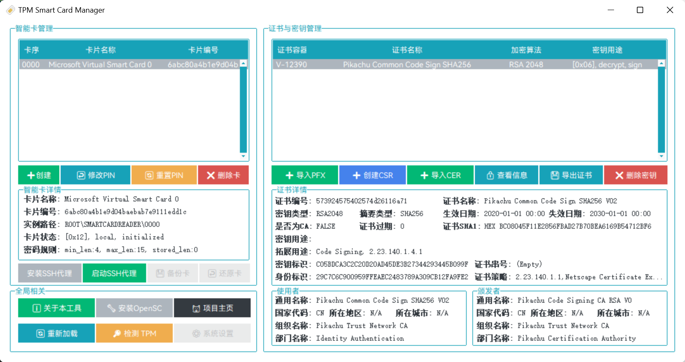

# TPM虚拟智能卡管理器

# TPM Virtual Smart Cards Manager

Create &amp; Manage Smart Cards on TPM

创建和管理TPM虚拟智能卡

## 介绍 / Introduction

TPM虚拟智能卡管理工具是一个管理Windows平台上的虚拟智能卡的图形化工具，允许创建、删除智能卡，并导入和管理智能卡上的证书，支持X509证书，同时借助WinCryptSSHAgent，可以自签名证书并应用于SSH登录等场景，可以部分替代物理智能卡（例如Yubikey、ePass等）的PIV和SSH功能，实现例如SSL双向认证、Bitlocker加解密、EFS加密系统、SSH认证等。

TPM虚拟智能卡管理工具依赖于Windows Tpmvscmgr模块。可以帮助用户在计算机上安全地存储和管理加密密钥、证书和其他敏感信息。TPM（受信任平台模块）是一个硬件安全模块，通常集成在计算机主板上，提供加密和安全功能。本工具使用的虚拟智能卡安全性接近物理智能卡，其私钥被TPM生成的专有密钥进行加密，且在任何时候无法在未加密时导出，并且仅在TPM安全芯片内部进行处理，以保证您密钥的安全，同时，本工具支持安全密钥/CSR生成，确保您的密钥不会被任何人（包括您自己）获取或者泄漏，也支持多种导入方式，包括本地导入密钥、证书，或者通过云端（使用X25519密钥协商与AES加密）安全下发，确保密钥无法被窃取。

TPM Virtual Smart Card Management Tool is a graphical tool for managing virtual smart cards on the Windows platform, allowing the creation, deletion, import, and management of certificates on smart cards. It supports X509 certificates and, with the help of WinCryptSSHAgent, can self sign certificates and be applied to scenarios such as SSH login. It can partially replace the PIV and SSH functions of physical smart cards (such as Yubikey, ePass, etc.), achieving SSL two-way authentication, Bitlocker encryption and decryption, EFS encryption system, SSH authentication, etc.

The TPM virtual smart card management tool relies on the Windows Tpmvscmgr module. It can help users securely store and manage encryption keys, certificates, and other sensitive information on their computers. TPM (Trusted Platform Module) is a hardware security module typically integrated on a computer motherboard, providing encryption and security functions. The security of the virtual smart card used in this tool is similar to that of a physical smart card. Its private key is encrypted by a proprietary key generated by TPM and cannot be exported without encryption at any time. It is only processed internally within the TPM security chip to ensure the security of your key. At the same time, this tool supports secure key/CSR generation to ensure that your key will not be obtained or leaked by anyone (including yourself). It also supports multiple import methods, including local import of keys, certificates, or secure distribution through the cloud (using X25519 key negotiation and AES encryption) to ensure that the key cannot be stolen.

相较于直接存储证书在Windows系统内，使用TPM虚拟智能卡的有点包括：

Compared to directly storing certificates within the Windows system, the advantages of using TPM virtual smart cards include:

- 安全性高：由于智能卡数据存储在硬件中，因此很难被黑客攻击。
- High security: Due to the fact that smart card data is stored in hardware, it is difficult to be attacked by hackers.
- 便于管理：用户可以轻松地在计算机上创建、删除和管理虚拟智能卡。
- Easy to manage: Users can easily create, delete, and manage virtual smart cards on their computers.
- 易于集成：许多操作系统和应用程序已经支持TPM虚拟智能卡，无需额外的硬件。
- Easy to integrate: Many operating systems and applications already support TPM virtual smart cards without the need for additional hardware.
- 成本效益：与传统的物理智能卡相比，TPM虚拟智能卡可以节省硬件和管理成本。

- Cost effectiveness: Compared to traditional physical smart cards, TPM virtual smart cards can save hardware and management costs.

<b color="red">注意：在使用本工具前，您需要提前安装[OpenSC](https://github.com/OpenSC/OpenSC/releases) </b>
<b color="red">Notice: Before using this tool, you need to install [OpenSC](https://github.com/OpenSC/OpenSC/releases) </b>

### 功能 / Function

- 虚拟智能卡管理：创建、删除、虚拟智能卡，修改重置密码
- 证书和密钥管理：导入、删除、证书和密钥，查看数字证书

- Virtual smart card management: create, delete, virtual smart cards, modify and reset passwords
- Certificate and Key Management: Import, Delete, Certificate and Key, View Digital Certificates

## 要求 / Requirement

- 系统：Windows 8 x86/64或者更高
- 软件：OpenSC Certutil Tpmvscmgr
- 硬件：TPM硬件 1.2/2.0或更高

- System: Windows 8 x86/64 or higher
- Software: OpenSC Certuti Tpmvscmgr
- Hardware: TPM hardware 1.2/2.0 or higher

## 参考 / Reference

1. [OpenSC/OpenSC: Open source smart card tools and middleware](https://github.com/OpenSC/OpenSC)
2. [windows-itpro-docs/windows/security/identity-protection/virtual-smart-cards](https://github.com/MicrosoftDocs/windows-itpro-docs/tree/public/windows/security/identity-protection/virtual-smart-cards)
